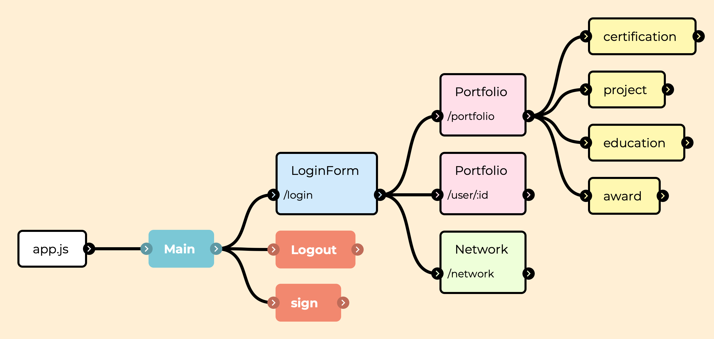
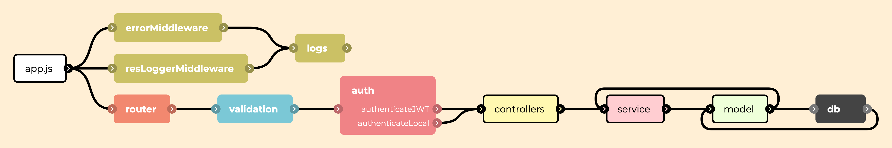

# Portfolio Website for Sharing

- react + express 를 이용한 포트폴리오 공유 사이트
- 모여봐요 동물의 숲 테마 적용

# 목차

1. [시작 가이드](#1-시작-가이드)

2. [프로젝트 기획 의도](#2-프로젝트-기획-의도)

3. [프로젝트에 대하여](#3-프로젝트에-대하여)

- 개발 기간
- 프로젝트 멤버
- 기술 스택(프론트, 백엔드 별)
- 주요 기능 및 프로젝트 구조
- 트러블 슈팅
- 프로젝트 회고

4. [이 프로젝트 활용법](#4-이-프로젝트-활용법)

# 1. 시작 가이드

### 프론트 엔드 서버 실행

```bash
cd front
yarn
yarn start
```

- front 폴더 내부 README 참고

### 백엔드 서버 실행

- back 폴더 내부 README 참고

# 2. 프로젝트 기획 의도

- 포트폴리오 공유 웹사이트는 기초적인 CRUD를 구현을 통해 각자의 기술스택 및 프로젝트 경험을 공유하는 공간을 만들고자 기획되었습니다. 다양한 프로젝트와 능력을 '모여봐요 동물의 숲 기반'으로 '취업의 숲'이라는 SNS형태로 만들어 서로의 포트폴리오 공유 및 협업 제안을 DM 형식으로 할 수 있는 웹 페이지를 만들고자 하였습니다.

# 3. 프로젝트에 대하여

### 1. 개발 기간 ⏱️

> • 22.07.10 ~ 22.07.21

### 2. 멤버 구성 ✔️

- [이창근](https://github.com/LCGechk0311?tab=repositories) 👑
- [조대찬](https://github.com/JoDaeChan)
- [이혜빈](https://github.com/hyeb-in)
- [진채영](https://github.com/devchaeyoung)
- 최은진
- [팀원 노션 페이지 링크](https://elegant-pizza-785.notion.site/1-18b6251e12364f06937518b276f6de15?pvs=4)

### 3. 기술 스택 ✔️

#### 백엔드

- Node.js : 18.16.0
- Framework : express 4.17.1
- Database : MongoDB 4.16.0
- ODM : mongoose 6.2.1
- Validation : joi 17.4.2
- Authentication : passport 0.4.1
- Authorization : jsonwebtoken 8.5.1
- Image Upload : multer 1.4.3
- Logging : winston 3.3.3 / morgan 1.10.0

#### 프론트

- Framework : react :17.0.2
- HTML / CSS
- State Management : redux 4.1.1
- Routing : react-router-dom 5.3.0
- HTTP Client : axios 0.21.4
- Image Upload : react-dropzone 11.4.2

### 4. 주요 기능 ✔️

#### 포트폴리오 CRUD

- 자신의 학력, 수상이력, 자격증, 프로젝트 별 작성 및 관리
- 전체 사용자 조회 및 포트폴리오 조회
- 스택별 포트폴리오 조회
- 포트폴리오 업데이트 및 변경항목만 업데이트
- 포트폴리오 삭제

#### 회원관리

- 회원가입시 메일 중복 검사 및 유효성 검사
- 회원 정보 업데이트 및 삭제

#### 로그인

- passport 를 이용한 회원 인증 및 JWT 토큰 발급
- 발급된 토큰으로 다른 API 사용 시 인가 및 인증
- 비밀번호 초기화 시 가입 이메일로 임시 비밀번호 발급
- 로그아웃 시 토큰 삭제

#### 프로필 UI

- 프로필 작성 완성도에 의한 UI 변경
- 프로필 이미지 업로드

#### API 중복 호출 방지

- DDOS 공격 방지를 위한 API 호출 제한

#### 유효성 검사 및 로깅

- 클라이언트로부터 받는 모든 데이터에 알맞은 유효성 검사 후 로직 수행
- 로깅을 통한 에러 및 요청 정보 확인

#### 페이지 기능 설명

- 개발자들의 포트폴리오를 한 곳에서 볼 수 있는 웹사이트
- 프로필을 작성할 때는 자신의 학력, 수상이력, 자격증, 프로젝트를 등록 가능
- 개발자들이 직접 작업한 프로젝트를 포트폴리오로 등록하고, 다른 개발자들의 포트폴리오를 참고 가능
- 프로젝트를 작성할 때는 프로젝트명, 프로젝트 설명, 프로젝트 기간, 프로젝트 스택 등록 가능
- 또한 다른 개발자들의 취득한 자격증이나 학력, 수상 내역을 공유 가능

### 프로젝트 구조 ✔️

#### 💻 Front-end


▶️ 컴포넌트별 폴더 구조

- components : 컴포넌트별 폴더 구조
- pages : 라우팅을 위한 페이지 컴포넌트
- lib : 공통으로 사용되는 함수
- hooks : 커스텀 훅
- api : axios 를 이용한 HTTP 통신
- styles : 공통으로 사용되는 스타일
- images : 공통으로 사용되는 이미지
- constants : 공통으로 사용되는 상수
- assets : 공통으로 사용되는 파일
- App.js : 라우팅
- index.js : 리액트 앱 렌더링

---

#### 💻 Back-end


▶️ 비즈니스 로직을 분리하는 3계층 구조

- Controller : 클라이언트의 요청을 받아 알맞은 서비스로 요청을 전달, 결과를 응답
- Service : 비즈니스 로직을 수행하고, 결과를 컨트롤러에게 전달
- Model : 데이터베이스와의 상호작용을 위한 스키마 및 모델 정의
- Middleware : 클라이언트의 요청을 받아 유효성 검사 및 인증, 인가를 수행하고, 결과를 컨트롤러에게 전달
- authenticate : passport 를 이용한 회원 인증 및 JWT 토큰 발급
- Config : 환경변수 및 로깅 설정

## 5. 트러블 슈팅

> ### 💡문제 1

- form data 에 들어있는 값으로만 update가 안되던 문제

#### 해결과정

form 요청 시 수정되지 않는 document key 값 삭제 , 서버 validator 수정

- 클라이언트에서 보내는 업데이트 정보에 값이 비어있는 key가 있다면 서버의 validator 미들웨어의 유효성검사를 통과하지 못함
- 클라이언트에서 요청을 보낼 때 비어있는 key는 필터링해서 유효값으로만 구성해서 요청
- 서버는 해당 API 요청을 validadation 할 때, 업데이트가 가능한 모든 key를 필수값이 아닌 옵션으로 설정
- 단, 수정사항이 하나라도 없다면 유효성 검증을 통과하지 못하게 설정

#### 해결

- 사용자는 자신이 원하는 항목만 수정 가능.

> ### 💡 문제 2

- 두 개의 식별자로 인한 혼란 : 스켈레톤 코드로 이미 구현되어있던 유저컬렉션 id key의 uuid4 와, 몽구스객체가 생성될 때 자동으로 부여되는 ObjectId, 두 개의 식별자를 사용함으로 인한 프론트와 서버간의 혼란 야기

#### 해결과정

uuid4 삭제 → 몽구스 ObjectID로 통일

- User 객체 생성 시 부여되던 id : uuid4 삭제
- 프론트와 서버가 사용할 식별자는 몽구스 ObjectID 하나로 통일
- 기존 uuid4 를 사용하던 모든 API 전면 수정

#### 해결

- 식별자를 하나로 통일함으로써 좀 더 단순한 요청, 응답이 가능해지고 식별자를 헷갈리는 실수를 미연에 방지할 수 있다.

> ### 💡 문제 3

- POST, PUT,DELETE 요청에, 데이터베이스에 저장되기 전 응답하던 문제
  > 작성, 수정, 삭제 요청이 들어오면, 서버는 업데이트해야할 document를 찾고 업데이트 후 결과를 응답 해야하지만, 찾아낸 document를 먼저 반환하고 업데이트하는 현상이 발생. 해당 이슈로 클라이언트에선 요청이 정상적으로 처리되었는지 바로 확인할 수 없음

#### 해결과정

비동기처리 점검 → 실패 → mongoose Query 추가

- 비동기 처리 과정에서 일어난 문제로 예상하고 데이터를 업데이트하는 구간의 async, await 이 제대로 사용되고있는지 확인
- promise.all 을 사용해 처리전까지 대기명령을 내려도 동일한 증상이 일어났다

#### 해결

- mongoose query 중 new 옵션을 사용해 업데이트를 실행한 뒤의 정보를 반환하게 한다.

> ### 💡 문제 4

- static async findByEmail({email})함수에서 검색이 올바르게 이루어지지 않던 문제

#### 문제 상황

- 이미 DB에 저장되어 있는 데이터들 중에 같은 정보를 또 생성하려고 하는걸 방지하기위해 DB에 그 정보가 있나 검색하는 도중에 문제가 발생하였습니다.

#### 문제점 파악

- findByEmail함수를 호출할 때 ‘email’값을 전달하면 User.findOne({email : emailValue})와 같이 검색하고자 하는 것이 아니라 User.findeOne({email})과 같이 일치하는 데이터를 찾는 것이 목적이여서 올바르게 이루어지지 않았던 거 같았습니다.

#### 해결과정

- findByEmail 함수의 시그니처를 수정하여 객체 형태의 인자가 아닌 직접 ‘email’의 값을 받도록 변경하였습니다.

> ### 💡 문제 5

- Error: Cannot set headers after they are sent to the client 오류 문제

#### 문제점 파악

이 문제는 서버가 클라이언트에게 응답을 보낸 후에도 추가적으로 응답을 보내려고 할 때 발생하는 문제입니다. 저는 uploadUser 함수에서 handleImageUpload 함수를 호출한 후, 이미지 업로드 작업이 완료되기 전에 next()를 호출하여 다음 미들웨어 함수로 이동한 경우가 그래서 handleImageUpload함수에서 next()를 통해 응답을 보내고 uploadUser함수가 끝날 때 응답을 또 보내게 되어 오류가 발생하였습니다.

#### 해결과정

- next()도 실제로 응답을 보내는 것으로 간주한다는 것을 알았습니다.
- 첫번째 해결방법으로는 아래 handleImageUpload함수 내의 try next()부분을 빼버리거나,

```
try {
next();
} catch (error) {
next(error);
}
```

- 두번째로는 handleImageUpload함수내에서는 건드리지 않고 uploadUser함수에서 handleImageUpload함수를 호출할 때
  `await handleImageUpload(req, res, () => {});` 이부분의 next 부분에 빈 콜백함수를 주어 이미지 업로드 작업이 완료된 후에만 응답이 전송되게 만들었습니다.

> ### 💡 문제 6

- 특정 주소에서 리로드 시 로그인창이 뜨는 문제 !

#### 해결과정

새로고침 시 userState의 값이 휘발 되어 생기는 문제였다. 그 방안으로 sessionStorage에서 유저의 토큰 값을 가져와서 유저가 로그인 되어있는지 확인하는 절차를 가졌고 토큰 값이 없을 시에만 로그인 페이지로 넘겨주게끔 만들었다.
그러나 이런 경우에 토큰이 유효하지 않을수도 있기 때문에 토큰이 유효한지 체크하는 과정을 한 번 거쳤고 만약 토큰이 유효하지 않다면 로그인페이지로 넘겨주는 방식을 취했다.

> ### 💡 문제 7

- 프로필 사진 업로드 시 이미지 업로드 후 리로드를 해야 클라이언트에 적용이 됨

#### 해결과정

로그인 요청 시 서버에서 응답하는 데이터를 살펴보니, 토큰과 passport에서 생성한 user가 있는걸 확인. 응답받은 user객체에서 이미지url을 추출하지 못하고 있었음

#### 해결

발급받은 token을 이용해서 서버로 get요청을 보내 유저에 대한 상세정보를 받아와 dispatch payload에 응답 데이터를 넣고 유저 상세정보와 이미지를 최신화 하였다.

### 6. 이번 프로젝트에 대한 회고 ✔️

> 무엇보다 초기 기획은 아무리 많이해도 부족하지 않다는것과 팀원들과의 소통과 배려가 중요하다는 것을 느꼈습니다.
> 탄탄한 기획과 확실한 역할분담이 이루어졌다면 이번 프로젝트를 진행하는데 있어서 좀 더 나은 결과를 얻을 수 있지 않았을까 하는 아쉬움이 있었지만
> , 프로젝트를 진행하며 팀원들과 직접 개발한 웹이 실행되는걸 볼 때 소소한 행복함을 느꼈습니다.
> 팀원들 모두가 처음 해보는 프로젝트임에도 불구하고, 피곤하고 힘들어도 모두가 열정적으로 프로젝트를 진행해주었고 서로의 부족한 부분을 채워주며 프로젝트를 완성해나갔습니다.
> 이번 프로젝트를 진행하면서 힘들기 보단 개발에 대한 흥미를 더욱 가지게 되었으며 다음 프로젝트에서는 더욱 발전된 모습으로 참여하고 싶습니다.

#### 🐾 프론트

> 첫 프로젝트를 시작했지만 역할 분담조차 감이 잡히지 않아 어려웠지만 프로젝트 끝무렵인 지금은 처음 기획 했을 때와 달리 구현하지 못한 기능들에 대한 아쉬움도 남고 다음 프로젝트때 어떤 순서로 진행해야할 지 조금은 감을 잡을 수 있었습니다. 진행하면서 파일구조나, 컴포넌트 양식들은 제대로 나누지 못한점, 백엔드에서 어떤 데이터를 받아오는지 조차 감을 잡지 못해 엉뚱한 경로로 데이터를 받아오며 에러의 원인을 찾아 헤매는 시행착오도 겪었습니다. 매일 오피스아워를 통해 실제 현업에서 사용하는 코딩컨벤션이나 폴더구조에 대해 알아가게 되었습니다. 첫주차에 코드리뷰를 받으며 더 효율적이고 간략한 코드를 작성할 수 있는 방법을 알게되었습니다. 다음 프로젝트에서는 무작정 빠르게 시작하는 것이 아니라 하루, 이틀정도의 파일구조나 컴포넌트 구조를 전체적으로 기획하는 시간을 가지는 것이 가장 빠르게 원하는 프로젝트를 달성할 수 있다는 것을 알게되었습니다. 처음 피그마로 화면 기획을 하면서 만들고자했던 좋아요, 팔로잉, 프로필 클릭 시 드롭다운 기능들은 하지 못하였지만 막연히 수업을 들으며 따라갈 때와 달리 이번 프로젝트를 끝나고 다음으로 어떤 기능을 구현할지 각자만의 방향성이 생겼습니다.

#### 🐾 백엔드

> 프로젝트를 시작할 때 MVP가 무엇인지도 모르고 REST대한 개념조차 없이 무작정 시작했는데 되돌아보니 정말 많이 무지했던 것 같습니다. 이 번 프로젝트를 하며 가장 크게 느낀 건
> 무엇보다 서버의 구조를 어떻게 모델링할지와 데이터를 어떻게 가공할지가 가장 중요하다고 느꼈습니다. 그 이유로는 이슈가 생겼을 때 서버의 구조가 명확하지 않고 개발자들간의 컨밴션이 지켜지지 않았을 때, 빠른 대응이 어려웠고
> 유지, 보수에 어려움을 많이 느꼈습니다. 또 서버의 코드를 깔끔히 유지하고 정돈하는 일도 중요하다고 느꼈습니다. REST가 정확히 어떤 개념인지 몰랐지만 이번 프로젝트로 몸으로 배웠습니다. 진짜. 서버와 클라이언트를 나누고, 시스템을 계층화시켜서 각자 해야할 일을 명확하게 구분하고 표준 프로토콜에 따라서 누구나 쉽게 이해하고 사용할 수 있는 시스템이 중요하다는걸 느꼈습니다.

# 4. 이 프로젝트 활용법

- 기본적인 CRUD만 구성된 홈페이지 입니다.
- 아래 git clone 명령어를 통해 이 프로젝트 기반으로 **추가적인 기능 구현을 연습**할 수 있습니다.

```bash
git clone https://github.com/devchaeyoung/portfolio-website-for-sharing.git
```

## ➕ 추가적인 기능 예시

- 프로필 사진 용량 제한 기능
- 유저간의 메세지 기능
- 포트폴리오 유저간의 소통가능 한 게시판 기능(개인 회고나 기업 면접 후기 등)
- 게시판 댓글 기능
- 게시글 검색 기능 등
